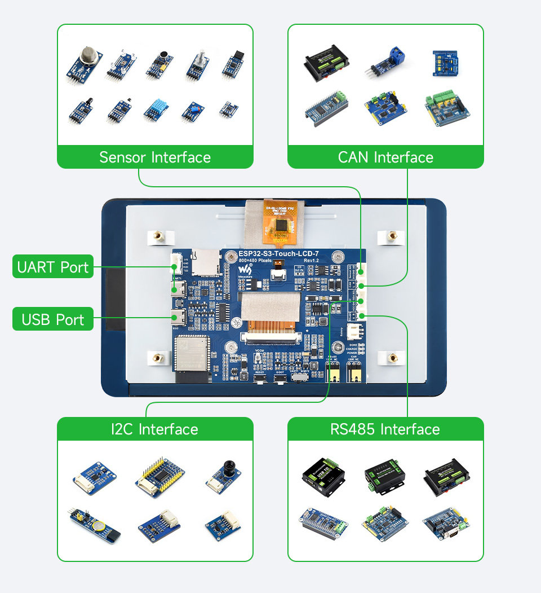
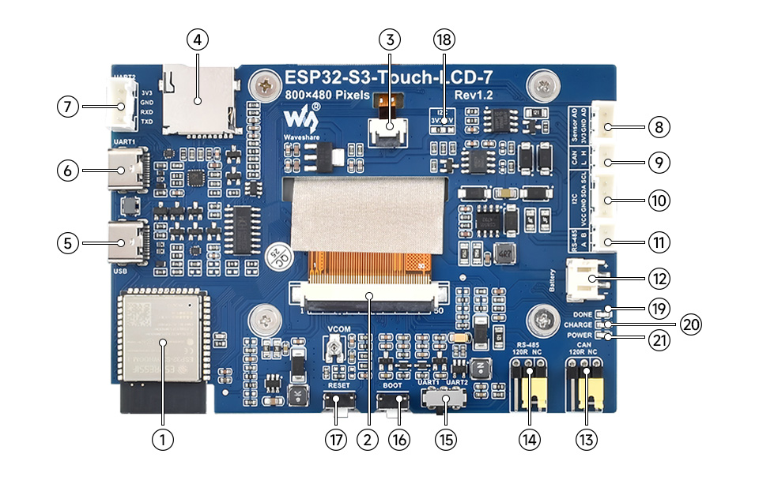
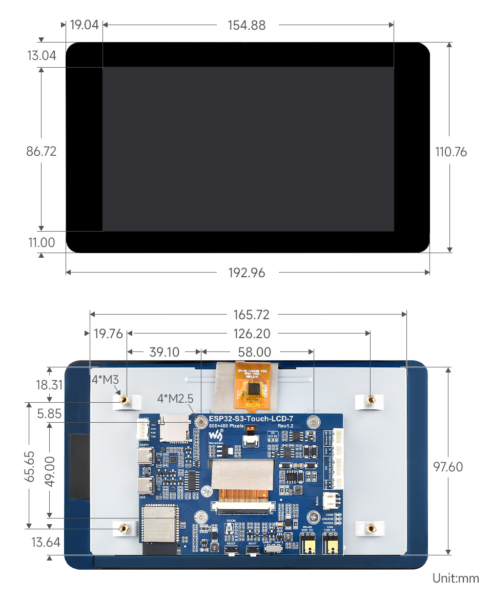
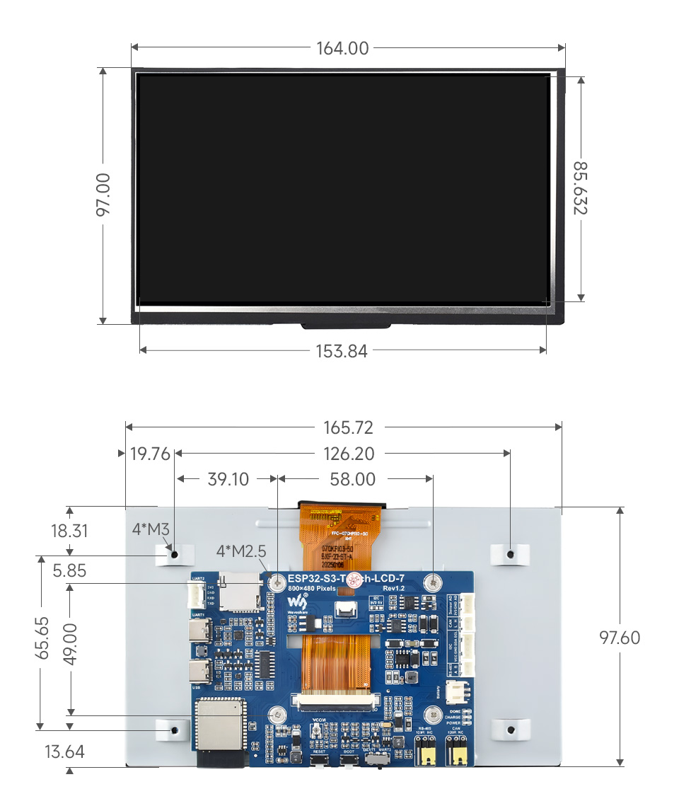
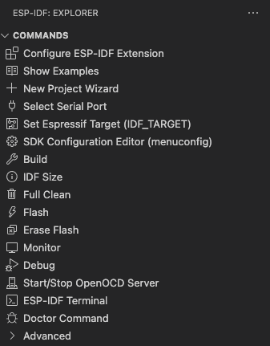
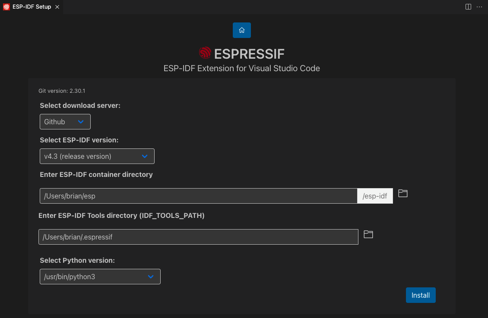
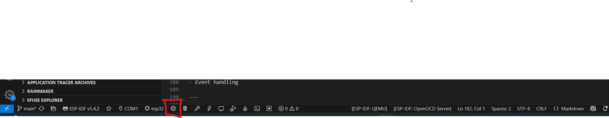
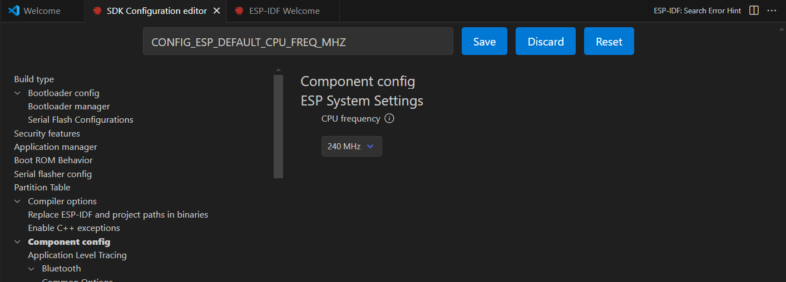

# Wareshare 7.5" ESP32-S3 HMI Programming Guide

## Table of Contents
- [1. Introduction](#1-introduction)
- [2. Hardware Information and Connections](#2-hardware-information-and-connections)
  - [2.1 Development Board Specifications](#21-development-board-specifications)
  - [2.2 Peripheral Devices](#22-peripheral-devices)
  - [2.3 Components on the Development Board](#23-components-on-the-development-board)
  - [2.4 Board Dimensions (ESP32-S3-Touch-LCD-7)](#24-board-dimensions-esp32-s3-touch-lcd-7)
  - [2.5 Board Dimensions (ESP32-S3-LCD-7)](#25-board-dimensions-esp32-s3-lcd-7)
- [3. Development Environment Setup](#3-development-environment-setup)
- [4. Precautions before programing](#4-precautions-before-programing)
- [5. GUI Development (HMI GUI)](#5-gui-development-hmi-gui)
- [6. Integration with ESP32-S3](#6-integration-with-esp32-s3)
- [7. Real-World Applications](#7-real-world-applications)
- [8. Debugging and Deployment](#8-debugging-and-deployment)
- [9. Additional Resources](#9-additional-resources)

---

## 1. Introduction
The ESP32-S3 development board with a display is available in both touch and non-touch versions, offering a resolution of 800x480.  
It features a dual-core 32-bit LX7 processor running at 240 MHz and includes Wi-Fi and Bluetooth connectivity via an integrated antenna.

This documentation aims to help first-time users develop projects from scratch using this HMI display module.

---

## 2. Hardware Information and Connections

### 2.1 Development Board Specifications

| Feature                 | Description                                                              |
|-------------------------|--------------------------------------------------------------------------|
| Processor               | Xtensa 32-bit LX7 dual-core, up to 240 MHz                               |
| Wireless Connectivity   | 2.4GHz Wi-Fi (802.11 b/g/n), Bluetooth 5 (BLE), onboard antenna          |
| Internal Memory         | 512KB SRAM, 384KB ROM                                                    |
| External Memory         | 8MB PSRAM, 16MB Flash                                                    |
| Display                 | 7" LCD, 800×480 resolution, 65K colors                                   |
| Touchscreen             | 5-point capacitive (touch version only), via I2C                         |
| Interfaces              | CAN, RS485, I2C, TF card slot, full-speed USB                            |
| Graphics Library        | Supports GUI frameworks like LVGL                                       |
| Power and Clock Control| Flexible clock and module-level power management for low-power scenarios |

---
[1]

### 2.2 Peripheral Devices
[1]

---

### 2.3 Components on the Development Board
[1]

| No | Component Name                      | Description                                                              |
|----|-------------------------------------|--------------------------------------------------------------------------|
| 1  | ESP32-S3N16R8                       | 240MHz, 8MB PSRAM, 16MB Flash, Wi-Fi & Bluetooth-enabled SoC            |
| 2  | 7-inch display panel connector      | Connector for the 7” LCD panel                                           |
| 3  | Touch panel connector               | Connector for the touch panel                                            |
| 4  | TF card slot                        | MicroSD card slot                                                        |
| 5  | USB Type-C port                     | USB Type-C interface for programming                                     |
| 6  | UART1 port                          | UART via USB Type-C                                                      |
| 7  | UART2 connector                     | UART1 and UART2 share same line, selectable via switch                   |
| 8  | Sensor header                       | Header for connecting external sensors                                   |
| 9  | CAN header                          | CAN bus interface                                                        |
| 10 | I2C header                          | I2C communication header                                                 |
| 11 | RS485 header                        | RS485 communication header                                               |
| 12 | 3.7V lithium battery header         | PH2.0 connector for lithium battery input                                |
| 13 | CAN terminal resistor selector      | Switch for enabling/disabling CAN termination resistor                   |
| 14 | RS485 terminal resistor selector    | Switch for enabling/disabling RS485 termination resistor                 |
| 15 | UART selector                       | Selector switch for UART1 or UART2                                       |
| 16 | BOOT button                         | Hold during startup for firmware upload                                  |
| 17 | RESET button                        | Resets the system                                                        |
| 18 | I2C level selector                  | Switch for selecting 3.3V / 5V I2C level                                  |
| 19 | DONE indicator                      | Indicates battery charge complete                                        |
| 20 | CHG indicator                       | Indicates battery is charging                                            |
| 21 | PWR indicator                       | Power status LED                                                         |

---

### 2.4 Board Dimensions (ESP32-S3-Touch-LCD-7)


---

### 2.5 Board Dimensions (ESP32-S3-LCD-7)


---

## 3. Development Environment Setup
### 3.1 Required Tools
- ESP-IDF extention for VsCode
- Squarline Studio

#### ESP-IDF extention and installation Proccess
For this documantation available latest verison is V5.4.2
we are going to work with this version for whole document [2]

Make sure to review our [Espressif documentation](https://docs.espressif.com/projects/vscode-esp-idf-extension/en/latest/index.html) first to properly use the extension.


1. Download and install [Visual Studio Code](https://code.visualstudio.com/).

2. Install ESP-IDF system prerequisites for your operating system:

- Prerequisites for [MacOS and Linux](https://docs.espressif.com/projects/esp-idf/en/latest/esp32/get-started/linux-macos-setup.html).
- For Windows there is no additional prerequisites.

3. In Visual Studio Code, Open the **Extensions** view by clicking on the Extension icon in the Activity Bar on the side of Visual Studio Code or the **View: Show Extensions** command (shortcut: <kbd>⇧</kbd> <kbd>⌘</kbd> <kbd>X</kbd> or <kbd>Ctrl+Shift+X</kbd>).

4. Search for [ESP-IDF Extension](https://marketplace.visualstudio.com/items?itemName=espressif.esp-idf-extension).

5. Install the extension. After you install the extension, the  should appear in the VS Code Activity bar (left side set of icons). When you click the Espressif icon, you can see a list of basic commands provided by this extension.

<p>
  
</p>

6. From the command list, select **Configure ESP-IDF Extension** or press <kbd>F1</kbd> and type `Configure ESP-IDF Extension`. After, choose the **ESP-IDF: Configure ESP-IDF Extension** option.
   > **NOTE:** For versions of ESP-IDF < 5.0, spaces are not supported inside configured paths.

<p>
  
</p>

7. Choose **Express** and select the download server:

- Espressif: Faster speed in China using Espressif download servers links.
- Github: Using github releases links.

8. Pick an ESP-IDF version to download or the `Find ESP-IDF in your system` option to search for existing ESP-IDF directory.

9. Choose the location for ESP-IDF Tools (also known as `IDF_TOOLS_PATH`) which is `$HOME\.espressif` on MacOS/Linux and `%USERPROFILE%\.espressif` on Windows by default.

10. If your operating system is MacOS/Linux, choose the system Python executable to create ESP-IDF virtual environment inside ESP-IDF Tools and install ESP-IDF Python package there.

    > **NOTE:** Windows users don't need to select a Python executable since it is going to be installed by this setup.

11. Make sure that `IDF_TOOLS_PATH` doesn't have any spaces to avoid any build issues. Also make sure that `IDF_TOOLS_PATH` is not the same directory as `IDF_PATH`.

12. You will see a page showing the setup progress status, including ESP-IDF download progress, ESP-IDF Tools download and install progress as well as the creation of a Python virtual environment.

13. If everything is installed correctly, you will see a message that all settings have been configured. You can start using the extension.

Check the [Troubleshooting](#Troubleshooting) section if you have any issues.


---

## 4. Precautions before programing
- The development board has an onboard automatic download circuit, the Type C port at the UART silk screen is used for program download and log printing. After downloading the program, press the RESET button to run the program.

- The CAN and RS485 peripherals use jumpers to connect the 120 ohm resistor by default, and NC can optionally cancel terminal resistor connection.

- The development board uses USB to download the demo. If the port cannot be recognized, please enter boot mode (press and hold the boot button, then connect to the computer, and then release the boot button). After downloading the demo, press the RESET button to run the demo.


__Before you start be sure to set esp32 configuration is right__
the configuration process will be doing as shown as below
```
CONFIG_FREERTOS_HZ=1000
CONFIG_ESP_DEFAULT_CPU_FREQ_MHZ_240=y
CONFIG_ESPTOOLPY_FLASHMODE_QIO=y
CONFIG_ESPTOOLPY_FLASHFREQ_120M=y [Need to be consistent with PSRAM]
CONFIG_SPIRAM_MODE_OCT=y
CONFIG_IDF_EXPERIMENTAL_FEATURES=y and CONFIG_SPIRAM_SPEED_120M=y [Need to be consistent with FLASH]
CONFIG_SPIRAM_FETCH_INSTRUCTIONS=y
CONFIG_SPIRAM_RODATA=y
CONFIG_ESP32S3_DATA_CACHE_LINE_64B=y
CONFIG_COMPILER_OPTIMIZATION_PERF=y
#The following LVGL configuration items are helpful for frame rate improvement (LVGL v8.3):
#define LV_MEM_CUSTOM 1 or CONFIG_LV_MEM_CUSTOM=y
#define LV_MEMCPY_MEMSET_STD 1 or CONFIG_LV_MEMCPY_MEMSET_STD=y
#define LV_ATTRIBUTE_FAST_MEM IRAM_ATTR or CONFIG_LV_ATTRIBUTE_FAST_MEM=y
```
[3]

First, open a project and click the **menuconfig** button from the bottom panel to set the configuration options as defined above.



After clicking it, a configuration panel will appear. Use the search bar in the panel to find and set each variable as needed, such as `CONFIG_ESP_DEFAULT_CPU_FREQ_MHZ`.



Make sure to update all parameters listed in the precautions section.

After completing all of these setup steps, you can flash the sample **Hello World** project from the ESP-IDF template projects.

Once you confirm that everything is working correctly, we can continue with the basics of LVGL — including page structures, UI components, and event handling.

you can reach th edemo project from the site which u can find from referances [3]
---

## 5. GUI Development (HMI GUI)
- Page structure
- UI components: buttons, sliders, text
- Event handling

---

## 6. Integration with ESP32-S3
- Serial communication
- Sending and receiving data
- Hardware feedback (e.g. LEDs, buzzer)

---

## 7. Real-World Applications
- Displaying sensor data
- Menu systems
- Wi-Fi-connected applications

---

## 8. Debugging and Deployment
- Serial port log analysis
- Troubleshooting tips
- Ensuring stable performance

---

## 9. Additional Resources
- Datasheets
- GitHub sample projects
- Forums and tutorial links

## Referances
[1] https://docs.espressif.com/projects/esp-idf/en/v5.4.2/esp32s3/get-started/index.html#what-you-need

[2] https://docs.espressif.com/projects/esp-idf/en/v5.4.2/esp32s3/get-started/index.html#what-you-need

[3] https://files.waveshare.com/wiki/ESP32-S3-Touch-LCD-7/ESP32-S3-Touch-LCD-7-Demo.zip

[4] https://files.waveshare.com/wiki/ESP32-S3-Touch-LCD-7/ESP32-S3-Touch-LCD-7-Demo.zip